# 이커머스 플랫폼 도메인 플로우 설계서

> 이 문서는 주문의 생성부터 완료까지의 전체 라이프사이클을 정의한다.
> 각 도메인(주문, 취소, 반품, 환불, 재고)이 어떤 시점에, 왜, 어떻게 상호작용하는지를 중심으로 설계한다.

---

## 1. 메인 주문 라이프사이클 (타임라인 기반)

참고 프로젝트의 D-0 ~ D+N 타임라인 접근법을 채택하되,
각 단계에서 발생하는 **도메인 이벤트**, **비즈니스 판단**, **사이드 이펙트**를 함께 정의한다.

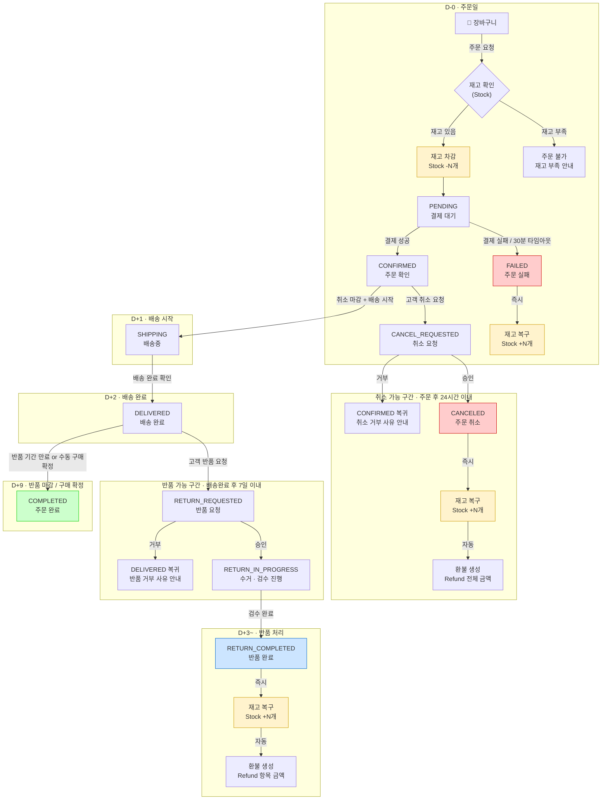

### 핵심 설계 결정과 근거

| 결정 | 근거 |
|------|------|
| **재고 차감 시점 = 주문 생성(PENDING)** | 결제 완료 후 차감하면, 결제 중 다른 고객이 같은 재고를 가져갈 수 있음. 선차감 후 실패 시 복구가 더 안전. |
| **결제 실패 = FAILED (Cancel 아님)** | 결제조차 안 된 주문은 "취소"가 아닌 "실패"로 분류. Cancel은 결제 완료 후에만 의미가 있음. |
| **취소 마감 = 24시간** | 배송 준비(포장, 피킹)에 통상 24시간 소요. 이 시간 내 취소는 물류 비용 없이 처리 가능. |
| **반품 마감 = 배송완료 후 7일** | 전자상거래법 기준 7일. 이 기간은 법적 의무이므로 단축 불가. |
| **반품은 항목(Item) 단위, 취소는 주문(Order) 단위** | 배송 전 취소는 전체 주문을 무효화. 배송 후 반품은 일부 상품만 문제일 수 있음. |

---

## 2. 주문 상태 머신 (Order State Machine)

### 2.1 전체 상태 전이도

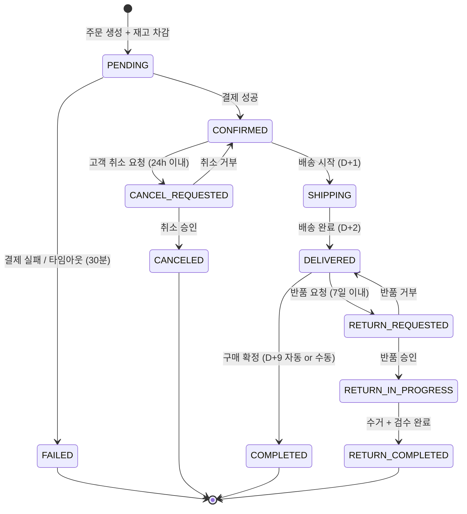

### 2.2 상태 전이 규칙 상세

각 전이에 대해 **누가(Actor)**, **언제(When)**, **왜(Why)**, **그 다음엔(Then)** 을 정의한다.

| # | FROM | TO | Actor | 선행 조건 | 사이드 이펙트 | 실패 시 |
|---|------|----|-------|----------|--------------|--------|
| 1 | — | `PENDING` | 고객 | 장바구니에 상품 존재, 재고 ≥ 주문수량 | 재고 차감, OrderHistory 기록 | 재고 부족 → 주문 거부 |
| 2 | `PENDING` | `CONFIRMED` | 시스템 | 결제 성공 | OrderHistory 기록 | — |
| 3 | `PENDING` | `FAILED` | 시스템 | 결제 실패 or 30분 타임아웃 | **재고 복구**, OrderHistory 기록 | — |
| 4 | `CONFIRMED` | `CANCEL_REQUESTED` | 고객 | `ordered_at`으로부터 24시간 이내, 진행중 취소 없음 | Cancel 레코드 생성(REQUESTED), OrderHistory 기록 | 기간 초과 → 거부 |
| 5 | `CANCEL_REQUESTED` | `CANCELED` | 관리자/시스템 | Cancel 승인 판단 | **재고 복구**, **환불 생성**, Cancel→APPROVED, OrderHistory 기록 | — |
| 6 | `CANCEL_REQUESTED` | `CONFIRMED` | 관리자 | 취소 거부 판단 (사유 필수) | Cancel→REJECTED, OrderHistory 기록(거부 사유) | — |
| 7 | `CONFIRMED` | `SHIPPING` | 시스템 | 취소 요청 없음 (상태=CONFIRMED) | OrderHistory 기록 | — |
| 8 | `SHIPPING` | `DELIVERED` | 시스템 | 배송사 완료 확인 | **delivered_at 기록** (반품 기한 기준점), OrderHistory 기록 | — |
| 9 | `DELIVERED` | `RETURN_REQUESTED` | 고객 | `delivered_at`으로부터 7일 이내, 해당 항목 미반품 | Return 레코드 생성(REQUESTED), OrderHistory 기록 | 기간 초과 → 거부 |
| 10 | `RETURN_REQUESTED` | `RETURN_IN_PROGRESS` | 관리자 | 반품 사유 검토 완료 | Return→APPROVED, 수거 접수, OrderHistory 기록 | — |
| 11 | `RETURN_REQUESTED` | `DELIVERED` | 관리자 | 반품 거부 판단 (사유 필수) | Return→REJECTED, OrderHistory 기록(거부 사유) | — |
| 12 | `RETURN_IN_PROGRESS` | `RETURN_COMPLETED` | 시스템 | 상품 수거 + 검수 합격 | **재고 복구**, **환불 생성**, Return→COMPLETED, OrderHistory 기록 | 검수 불합격 → 반품 거부 처리 |
| 13 | `DELIVERED` | `COMPLETED` | 시스템/고객 | 반품 기간 만료(자동) or 고객 수동 확정, 진행중 반품 없음 | OrderHistory 기록 | — |

### 2.3 최종 상태 (Terminal States)

```
COMPLETED        ── 정상 종결. 더 이상 상태 변경 불가.
CANCELED         ── 취소 종결. 재고 복구 + 환불 완료 상태.
RETURN_COMPLETED ── 반품 종결. 재고 복구 + 환불 완료 상태.
FAILED           ── 주문 실패. 결제 이전 단계에서 종결.
```

> **왜 최종 상태를 4개로 분리했는가?**
>
> 하나의 "종료" 상태로 합치면 단순해 보이지만, 통계/정산에서 치명적이다.
> - "이번 달 정상 완료 주문 수" → `COMPLETED`만 카운트
> - "취소율" → `CANCELED / 전체`
> - "반품율" → `RETURN_COMPLETED / DELIVERED 이후`
> - "주문 실패율" → `FAILED / PENDING 진입`
>
> 각각의 종결 사유가 다른 KPI를 구성하므로, 분리가 필수적이다.

---

## 3. 취소 도메인 플로우 (Cancel Flow)

### 3.1 취소 판단 플로우차트

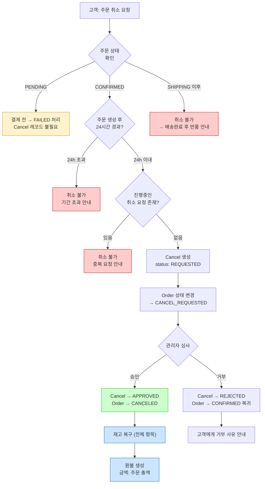

### 3.2 Cancel 상태 머신

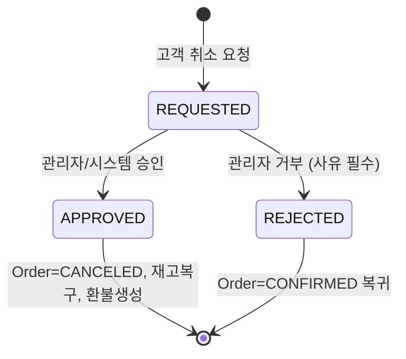

### 3.3 "왜 취소에도 승인 단계가 필요한가?"

단순히 "24시간 이내면 무조건 취소"로 설계할 수도 있다.
하지만 승인 단계를 두는 이유:

```
시나리오: 고객이 주문 후 23시간 59분에 취소 요청
         → 이미 물류센터에서 포장이 완료된 상태

승인 단계 없이 자동 취소하면:
  - 포장 비용 손실
  - 물류 프로세스 롤백 비용 발생

승인 단계가 있으면:
  - 관리자가 물류 상태 확인 후 판단
  - 이미 포장 완료 → 거부 + "배송 후 반품 안내"
  - 아직 미처리 → 승인 + 즉시 취소
```

> **단, 자동 승인 정책도 병행한다:**
> 주문 후 1시간 이내 취소 → 물류 프로세스 진입 전이므로 시스템 자동 승인.
> 1시간 ~ 24시간 → 관리자 수동 심사.

---

## 4. 반품 도메인 플로우 (Return Flow)

### 4.1 반품 판단 플로우차트

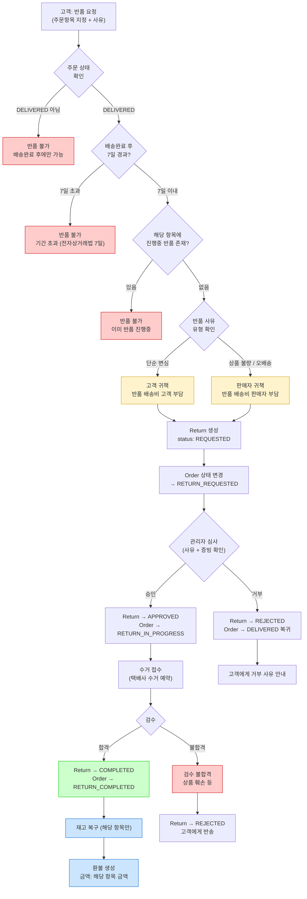

### 4.2 Return 상태 머신

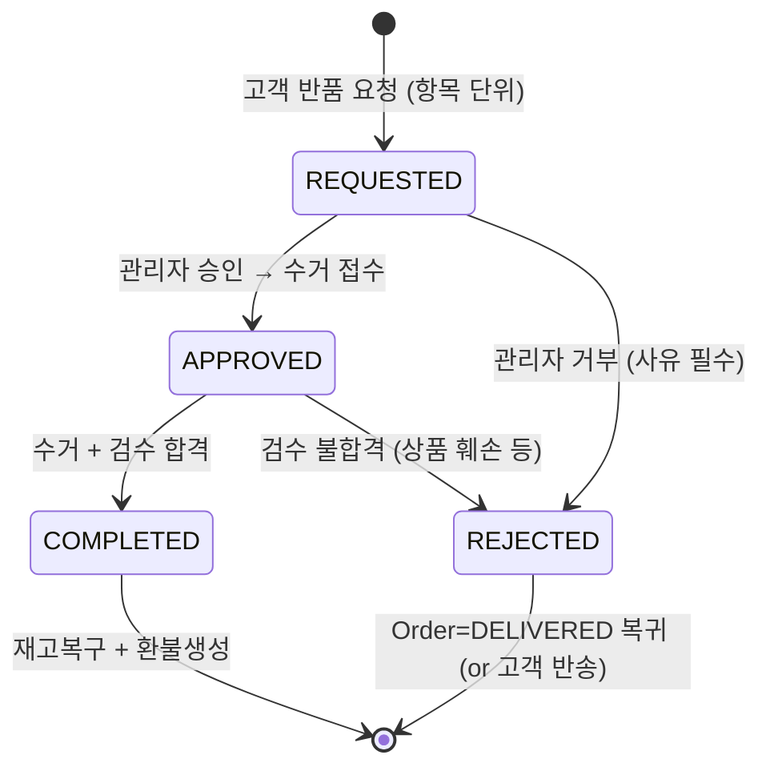

### 4.3 취소 vs 반품 비교

| 구분 | 취소 (Cancel) | 반품 (Return) |
|------|-------------|-------------|
| **시점** | 배송 전 (CONFIRMED 상태) | 배송 후 (DELIVERED 상태) |
| **단위** | 주문 전체 (Order) | 주문항목 개별 (OrderItem) |
| **기한** | 주문 후 24시간 | 배송완료 후 7일 |
| **상품 이동** | 없음 (아직 출고 전) | 있음 (고객 → 판매자 수거) |
| **검수** | 불필요 | 필수 (상품 상태 확인) |
| **배송비 부담** | 없음 | 사유에 따라 고객 or 판매자 |
| **환불 금액** | 주문 총액 | 해당 항목 금액 |
| **재고 복구 시점** | 취소 승인 즉시 | 검수 완료 후 |

### 4.4 부분 반품 시 주문 상태 처리

하나의 주문에 여러 항목이 있을 때, 일부만 반품하는 경우의 상태 전이.

```
예시: 주문 #100 (3개 항목)
  ├── OrderItem A: 노트북     300,000원
  ├── OrderItem B: 마우스       50,000원
  └── OrderItem C: 키보드       80,000원

시나리오: 마우스(B)만 반품 요청

[1] 반품 요청
    Order #100: DELIVERED → RETURN_REQUESTED
    Return 생성: order_item_id = B

[2] 반품 승인
    Order #100: RETURN_REQUESTED → RETURN_IN_PROGRESS
    Return: REQUESTED → APPROVED

[3] 검수 완료
    Order #100: RETURN_IN_PROGRESS → RETURN_COMPLETED
    Return: APPROVED → COMPLETED
    재고 복구: 마우스 Stock +1
    환불 생성: 50,000원 (마우스 가격 × 1개)

※ 주문의 나머지 항목(A, C)은 정상 구매 확정 상태
※ 환불은 반품된 항목(B)의 금액만 처리
※ 주문 총액 430,000원 중 50,000원만 환불
```

---

## 5. 환불 도메인 플로우 (Refund Flow)

### 5.1 환불 생성 조건

환불은 **독립적으로 요청되지 않는다**. 반드시 취소 또는 반품의 완료 결과로 자동 생성된다.

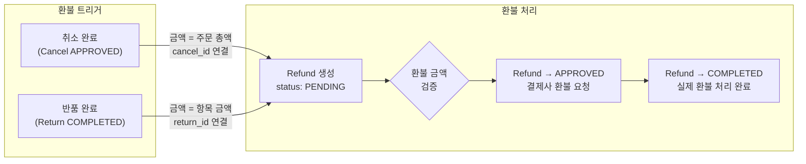

### 5.2 환불 금액 산정 규칙

| 환불 원인 | 산정 기준 | 예시 |
|----------|----------|------|
| **취소** | `Order.totalPrice` (주문 전체 금액) | 주문 총액 100,000원 → 환불 100,000원 |
| **반품 (고객 귀책)** | `OrderItem.price × quantity - 반품배송비` | 50,000원 상품 반품, 배송비 3,000원 → 환불 47,000원 |
| **반품 (판매자 귀책)** | `OrderItem.price × quantity` (배송비 없음) | 50,000원 상품 반품 → 환불 50,000원 |

### 5.3 Refund 상태 머신

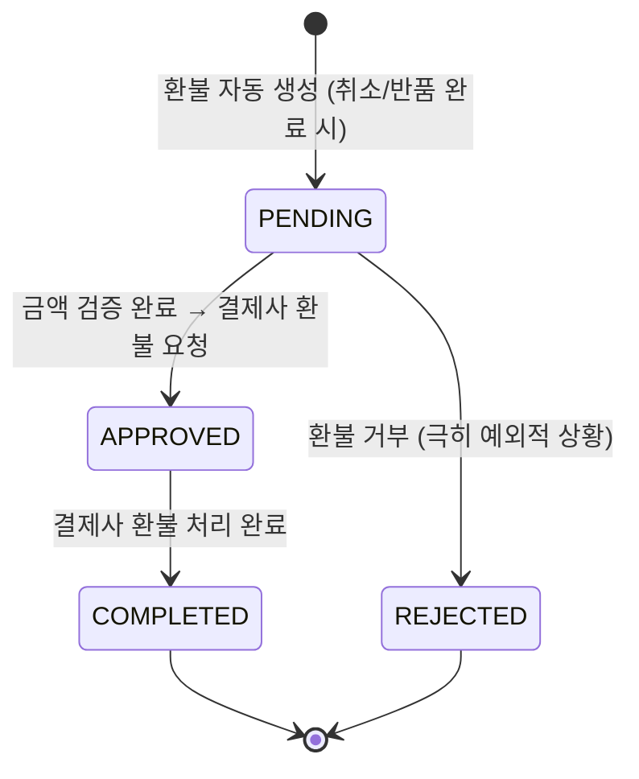

### 5.4 환불 추적성 (Traceability)

환불의 원인을 추적할 수 있어야 한다. "이 환불이 왜 발생했는가?"에 대해 항상 답할 수 있어야 한다.

```
Refund
  ├── order_id     → 어떤 주문에 대한 환불인가
  ├── cancel_id    → 취소에 의한 환불이면 연결 (nullable)
  ├── return_id    → 반품에 의한 환불이면 연결 (nullable)
  └── amount       → 실제 환불 금액

규칙: cancel_id와 return_id 중 반드시 하나만 값이 있어야 한다.
  ├── cancel_id ≠ null, return_id = null → "취소로 인한 환불"
  └── cancel_id = null, return_id ≠ null → "반품으로 인한 환불"
```

> **왜 Refund를 Cancel/Return에 내장하지 않고 분리했는가?**
>
> 취소/반품은 "비즈니스 프로세스"이고, 환불은 "결제 프로세스"이다.
> - 취소가 승인되어도 결제사 장애로 환불이 지연될 수 있다
> - 환불은 별도의 상태(PENDING → APPROVED → COMPLETED)와 별도의 생명주기를 가진다
> - 정산 시스템은 Refund만 조회하면 된다 (Cancel/Return의 세부 상태를 알 필요 없음)

---

## 6. 재고 관리 플로우 (Stock Flow)

### 6.1 재고 변동 전체 맵

재고는 4개의 도메인 이벤트에 의해서만 변동된다. **그 외 직접 수정은 불가능하다.**

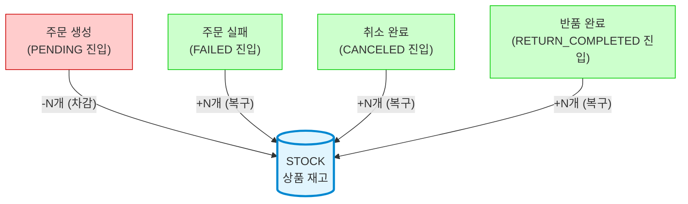

### 6.2 재고 변동 시나리오 (시간순)

```
상품 X 재고: 10개

  t1: 고객A 주문 (3개)     → 10 - 3 = 7개   [PENDING]
  t2: 고객B 주문 (2개)     → 7 - 2 = 5개    [PENDING]
  t3: 고객A 결제 실패       → 5 + 3 = 8개    [FAILED → 복구]
  t4: 고객C 주문 (5개)     → 8 - 5 = 3개    [PENDING]
  t5: 고객D 주문 (4개)     → 3 < 4 → ❌ 재고 부족, 주문 거부
  t6: 고객B 취소 완료       → 3 + 2 = 5개    [CANCELED → 복구]
  t7: 고객C 배송+반품(2개)  → 5 + 2 = 7개    [RETURN_COMPLETED → 복구]
```

### 6.3 재고 동시성 문제

```
문제 상황: 상품 X 재고 1개, 고객 A와 B가 동시에 주문

  Thread A: SELECT quantity FROM stocks → 1개 (읽음)
  Thread B: SELECT quantity FROM stocks → 1개 (읽음)
  Thread A: UPDATE quantity = 1 - 1 = 0 (성공)
  Thread B: UPDATE quantity = 1 - 1 = 0 (성공?!) → 재고 마이너스 위험!

해결: 비관적 락 (Pessimistic Lock, SELECT ... FOR UPDATE)

  Thread A: SELECT ... FOR UPDATE → 1개 (읽음, 락 획득)
  Thread B: SELECT ... FOR UPDATE → 대기 (락 블로킹)
  Thread A: UPDATE quantity = 0 → 커밋 → 락 해제
  Thread B: 락 획득 → quantity = 0 → 0 < 1 → 재고 부족 예외 → 주문 거부
```

### 6.4 재고 차감 vs 복구 비교

| 구분 | 차감 (Deduction) | 복구 (Restoration) |
|------|-----------------|-------------------|
| **시점** | 주문 생성 (PENDING) | 실패/취소/반품 완료 시 |
| **범위** | 주문의 모든 OrderItem | 취소: 전체 항목 / 반품: 해당 항목만 |
| **동시성** | 비관적 락 필수 | 복구는 경합 낮음 (동일 주문 중복 복구 방지만 필요) |
| **실패 처리** | 재고 부족 → 주문 거부, 차감 없음 | 복구 실패 → 재시도 (재고가 늘어나는 방향이라 안전) |

---

## 7. 자동화 & 스케줄러 플로우

시간 기반 정책은 사용자 액션 없이 **시스템이 자동으로 처리**해야 하는 부분이 있다.

### 7.1 자동 전이 이벤트

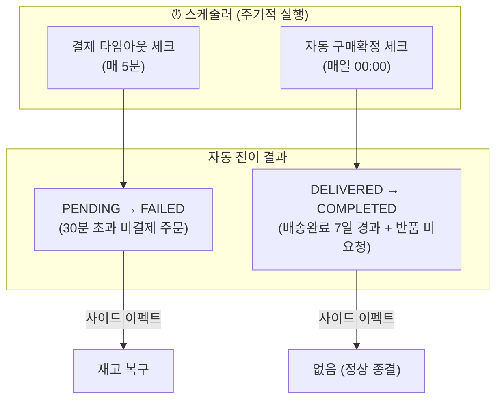

### 7.2 자동 전이 조건 상세

| 스케줄러 | 대상 조건 | 전이 | 사이드 이펙트 |
|---------|----------|------|------------|
| 결제 타임아웃 | `status=PENDING` AND `ordered_at + 30분 < now()` | → FAILED | 재고 복구 |
| 자동 구매확정 | `status=DELIVERED` AND `delivered_at + 7일 < now()` AND 진행중 반품 없음 | → COMPLETED | 없음 |

> **왜 취소 마감(24h)은 자동 전이가 아닌가?**
>
> 취소 마감은 "더 이상 취소가 불가능해지는 것"이지, 주문 상태가 자동으로 바뀌는 것이 아니다.
> 24시간이 지나도 CONFIRMED 상태는 유지되며, 배송이 시작(SHIPPING)되는 것은 물류 시스템의 별도 이벤트이다.
> 즉, 취소 마감은 **상태 전이를 차단하는 조건**이지 **상태를 전이시키는 이벤트**가 아니다.

---

## 8. 도메인 간 상호작용 맵

### 8.1 전체 도메인 관계

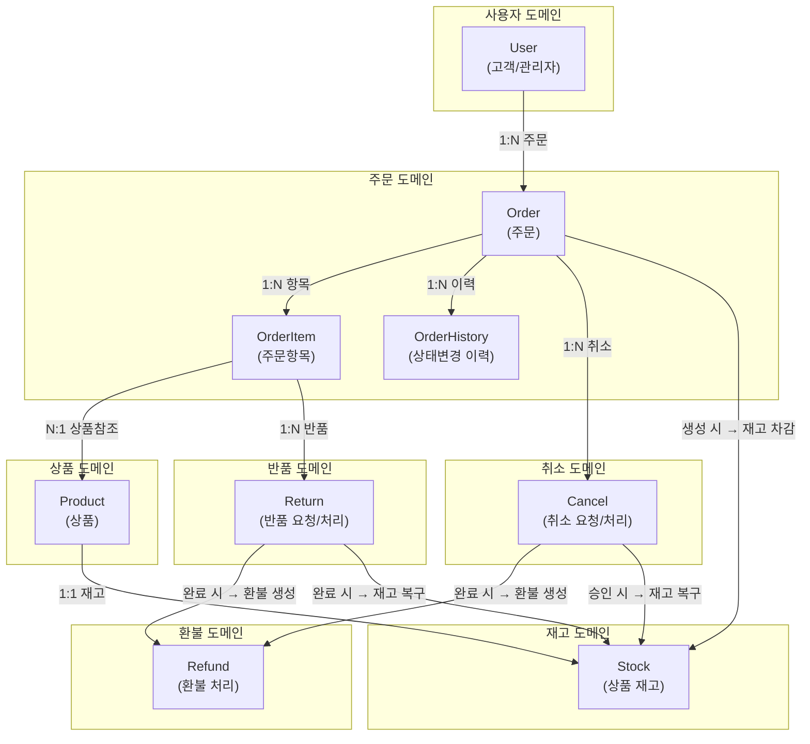

### 8.2 이벤트 발행 순서 (Sequence)

주문 생성부터 취소/반품/완료까지의 전체 이벤트 발행 순서.

```
── 정상 플로우 ──────────────────────────────────────

[고객] 주문 요청
  → Stock.deduct()           재고 차감
  → Order.create(PENDING)    주문 생성
  → OrderHistory.record()    이력 기록

[시스템] 결제 완료
  → Order.confirm()          PENDING → CONFIRMED
  → OrderHistory.record()

[시스템] 배송 시작
  → Order.ship()             CONFIRMED → SHIPPING
  → OrderHistory.record()

[시스템] 배송 완료
  → Order.deliver()          SHIPPING → DELIVERED
  → OrderHistory.record()

[시스템/고객] 구매 확정
  → Order.complete()         DELIVERED → COMPLETED
  → OrderHistory.record()


── 취소 플로우 ──────────────────────────────────────

[고객] 취소 요청
  → Cancel.create(REQUESTED)
  → Order.requestCancel()    CONFIRMED → CANCEL_REQUESTED
  → OrderHistory.record()

[관리자] 취소 승인
  → Cancel.approve()         REQUESTED → APPROVED
  → Order.cancel()           CANCEL_REQUESTED → CANCELED
  → Stock.restore()          재고 복구 (전체 항목)
  → Refund.create(PENDING)   환불 생성 (주문 총액)
  → OrderHistory.record()


── 반품 플로우 ──────────────────────────────────────

[고객] 반품 요청
  → Return.create(REQUESTED)
  → Order.requestReturn()    DELIVERED → RETURN_REQUESTED
  → OrderHistory.record()

[관리자] 반품 승인
  → Return.approve()         REQUESTED → APPROVED
  → Order.progressReturn()   RETURN_REQUESTED → RETURN_IN_PROGRESS
  → OrderHistory.record()

[시스템] 검수 완료
  → Return.complete()        APPROVED → COMPLETED
  → Order.completeReturn()   RETURN_IN_PROGRESS → RETURN_COMPLETED
  → Stock.restore()          재고 복구 (해당 항목만)
  → Refund.create(PENDING)   환불 생성 (항목 금액)
  → OrderHistory.record()
```

---

## 9. 엣지 케이스 & 비즈니스 결정

### 9.1 경계 시나리오

| # | 시나리오 | 발생 조건 | 처리 방식 | 근거 |
|---|---------|----------|----------|------|
| 1 | 취소 마감 직전 요청 | 고객이 23시간 59분에 취소 요청 | 접수는 허용. 관리자가 물류 상태 확인 후 승인/거부 | 고객 관점에서 기한 내 요청임 |
| 2 | 취소 심사 중 배송 시작 | CANCEL_REQUESTED 상태에서 물류가 출고 | 관리자가 취소 거부 → CONFIRMED → SHIPPING으로 전이. 고객에게 "배송 후 반품 안내" | 실물이 이미 이동 중 |
| 3 | 결제 대기 중 취소 | PENDING 상태에서 고객 취소 | Cancel 없이 PENDING → FAILED. 재고 즉시 복구 | 결제 전이므로 "취소"가 아닌 "포기" |
| 4 | 반품 검수 불합격 | 고객 과실로 상품 훼손 | Return → REJECTED. 상품을 고객에게 반송. 재고 복구 없음, 환불 없음 | 원상태 반품 불가 |
| 5 | 반품 중 또 반품 요청 | 같은 OrderItem에 대해 중복 반품 | 진행중 Return(REQUESTED/APPROVED) 존재 시 거부 | 하나의 항목은 한 번만 반품 가능 |
| 6 | 부분 반품 후 나머지 구매확정 | 3개 항목 중 1개 반품 완료 | 나머지 2개는 반품 기간 만료 시 자동 구매확정. 주문 상태는 RETURN_COMPLETED (반품 이력 보존) | 반품이 한 건이라도 있으면 COMPLETED가 아닌 RETURN_COMPLETED |
| 7 | 동시 주문으로 재고 초과 판매 | 재고 1개인데 2명이 동시 주문 | 비관적 락으로 순차 처리. 먼저 락 획득한 주문만 성공 | 초과 판매(overselling) 방지 |
| 8 | 환불 처리 중 결제사 장애 | Refund APPROVED 후 결제사 응답 없음 | Refund 상태 APPROVED 유지. 재시도 큐에 등록. 고객에게 "환불 처리중" 안내 | 환불은 확정적으로 처리되어야 함 |

### 9.2 상태 전이 불가 케이스 (방어 규칙)

아래 전이는 **절대 허용하지 않는다:**

```
SHIPPING    → CANCEL_REQUESTED   ❌ 배송 시작 후 취소 불가
COMPLETED   → (어떤 상태든)       ❌ 완료 후 변경 불가
CANCELED    → (어떤 상태든)       ❌ 취소 후 변경 불가
FAILED      → (어떤 상태든)       ❌ 실패 후 변경 불가
PENDING     → SHIPPING           ❌ 결제 없이 배송 불가
CONFIRMED   → DELIVERED          ❌ 배송 과정 생략 불가
DELIVERED   → SHIPPING           ❌ 역방향 전이 불가
```

---

## 10. 시간 정책 종합

```
주문 시점 (ordered_at)
  │
  │◄── 30분 ──► 결제 타임아웃 (PENDING → FAILED)
  │
  │◄──── 24시간 ────► 취소 가능 기간
  │
  ├── D+1: 배송 시작 (SHIPPING)
  │
  ├── D+2: 배송 완료 (DELIVERED)
  │        │
  │        │◄──────── 7일 ────────► 반품 가능 기간
  │        │                         (전자상거래법 의무 기간)
  │        │
  │        ├── D+9: 반품 마감 = 자동 구매확정 (COMPLETED)
  │
  ▼ 시간
```

| 정책 | 기준 시점 | 기한 | 자동 전이 여부 |
|------|----------|------|-------------|
| 결제 타임아웃 | `ordered_at` | 30분 | Yes → FAILED |
| 취소 가능 기간 | `ordered_at` | 24시간 | No (차단 조건일 뿐) |
| 반품 가능 기간 | `delivered_at` | 7일 | No (차단 조건일 뿐) |
| 자동 구매확정 | `delivered_at` | 7일 | Yes → COMPLETED |
