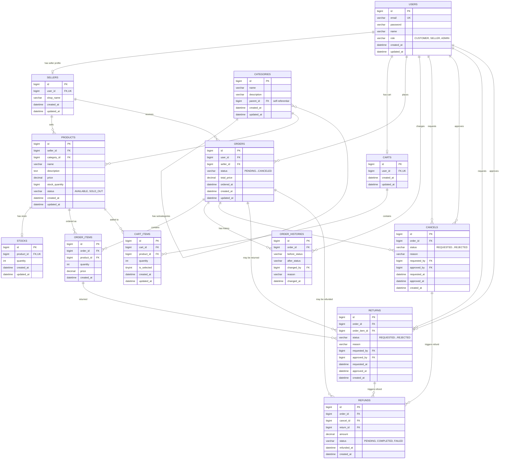

# E-Commerce Platform ERD

## MySQL Workbench에서 ERD 생성 방법

### 방법 1: Reverse Engineer (SQL 스크립트 임포트) - 추천

1. MySQL Workbench 실행
2. **File > New Model** 클릭
3. **File > Import > Reverse Engineer MySQL Create Script...** 클릭
4. `ecommerce_schema.sql` 파일 선택
5. **Execute >** 클릭 → **Next >** → **Finish**
6. EER Diagram 탭에서 ERD 확인
7. 테이블을 드래그하여 보기 좋게 배치

### 방법 2: 기존 DB에서 Reverse Engineer

1. MySQL Workbench에서 DB 연결
2. **Database > Reverse Engineer...** 클릭
3. 해당 스키마 선택 후 진행
4. ERD 자동 생성

### 방법 3: 이미지로 내보내기

1. ERD 생성 후 **File > Export > Export as PNG...** 선택
2. 또는 **File > Export > Export as SVG...** 선택

---

## ERD 다이어그램 (Mermaid)

---

## 테이블 관계 요약

| 관계 | 설명 |
|------|------|
| users 1:1 sellers | 판매자는 사용자 계정 필요 |
| users 1:1 carts | 사용자당 장바구니 1개 |
| users 1:N orders | 사용자는 여러 주문 가능 |
| sellers 1:N products | 판매자는 여러 상품 등록 |
| sellers 1:N orders | 판매자는 여러 주문 수신 |
| categories 1:N categories | 카테고리 계층 구조 (self-ref) |
| categories 1:N products | 카테고리별 여러 상품 |
| products 1:1 stocks | 상품별 재고 1개 |
| products 1:N order_items | 상품이 여러 주문에 포함 |
| products 1:N cart_items | 상품이 여러 장바구니에 추가 |
| orders 1:N order_items | 주문에 여러 상품 포함 |
| orders 1:N order_histories | 주문 상태 변경 이력 |
| orders 1:N cancels | 주문 취소 요청 |
| orders 1:N returns | 반품 요청 |
| orders 1:N refunds | 환불 처리 |
| order_items 1:N returns | 개별 상품 반품 |
| cancels 1:N refunds | 취소 → 환불 |
| returns 1:N refunds | 반품 → 환불 |
